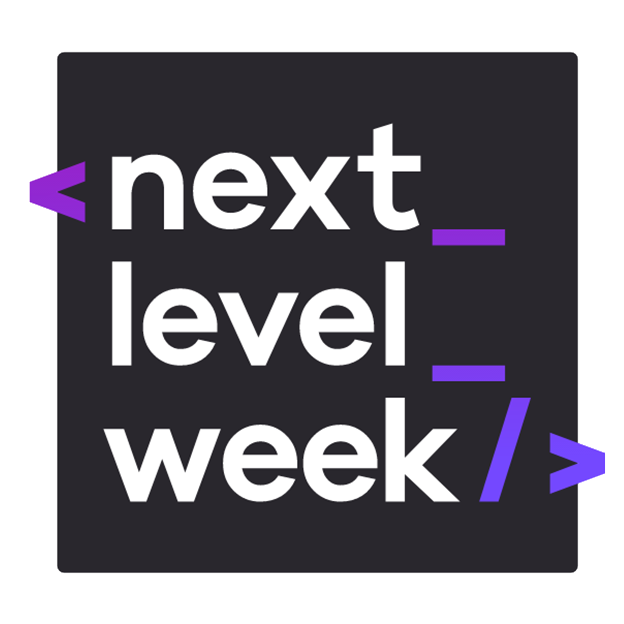
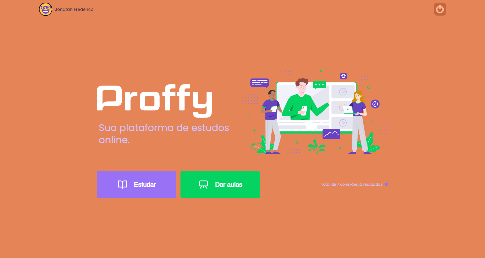
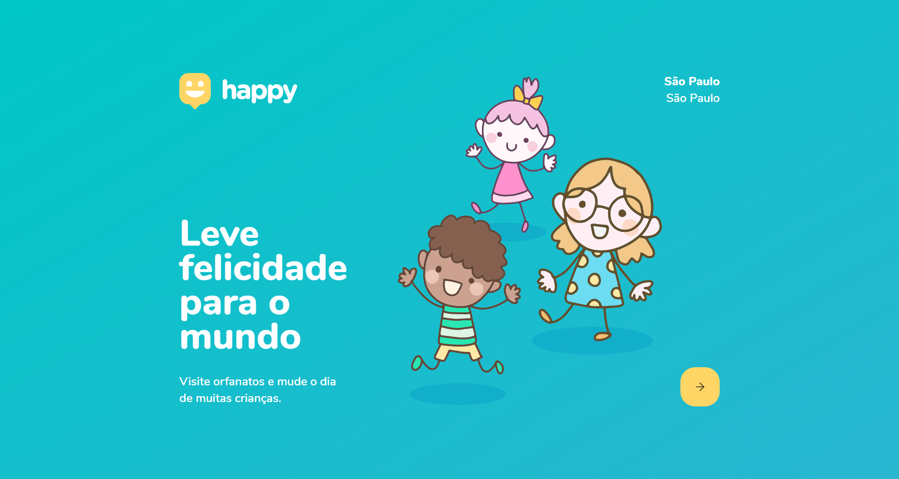

<h1 align="center">
    Projetos NLW
     
    
</h1>

    <a href="">Sobre o Repositório</a> •
    <a href="">Status</a> •
    <a href="">Demonstrações</a> •
    <a href="">Tecnologias</a> •
    <a href="">Licença</a>

 

## 💻 Sobre o Repositório
---
Este repositório tem como finalidade armazenar os projetos criados durante as edições do evento Next Level Week, cujo objetivo principal é ensinar vários conceitos relacionados a programação, impulsionando o aprendizado a todo vapor. 

Idealizadores do evento: [@Rocketseat](https://github.com/rocketseat)

## 📡 Status
---

    🎉 Semana da 3ª edição finalizada com sucesso! 🎉

## 📷 Demonstrações
---

    
    

## 👽 Tecnologias
---
As tecnologias mais utilizadas durante as edições do Next Level Week são as seguintes:
- NodeJS
- ReactJS
- SQLite
- Express
- JavaScript
- HTML5
- CSS3

## 📝 Licença
---
Todas as edições estão sob a licença MIT. Consulte o [README](https://github.com/Jonatan966/Projetos-NLW/blob/master/LICENSE) para mais detalhes.