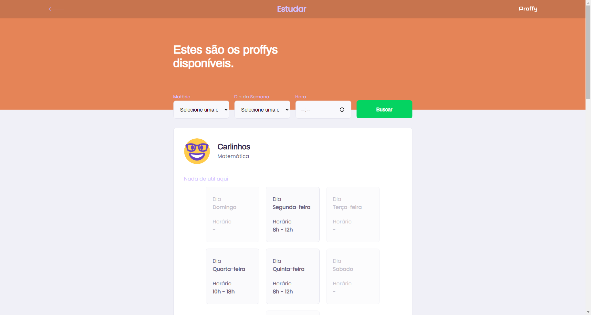

<p align="center">
    <a href="#">Sobre o Projeto</a> •
    <a href="#">Status</a> •
    <a href="#">Capturas de Tela</a> •
    <a href="#">Como executar</a> •
    <a href="#">Tecnologias</a>
</p>

<hr>

## 💻 Sobre o Projeto
A plataforma tem como objetivo auxiliar estudantes e professores, possibilitando agendar uma aula particular de uma determinada área. Projeto desenvolvido na **1ª edição do NLW**.

<hr>

## Status
<p align="center">
    🎉 Proffy 1.1 em processo de finalização 🎉
</p>

<hr>

## Capturas de Tela
<a align="center">
    
    
    
    
</a>

<hr>

## Como Executar
```
# Clone este repositório
$ git clone https://github.com/Jonatan966/Projetos-NLW

# Acesse a pasta do projeto no terminal/cmd
$ cd nlw2

# Instale as dependências nas pastas mobile e website
$ yarn install

# Acesse a pasta da API e execute a aplicação
$ cd server
$ yarn start

# Acesse a pasta do Website e execute a aplicação
$ cd website
$ yarn start
```

<hr>

## Tecnologias
As seguintes tecnologias foram utilizadas durante o desenvolvimento do projeto:
- HTML5
- CSS3
- JavaScript
- NodeJS
- SQLite
- Express
- ReactJS
- KnexJS